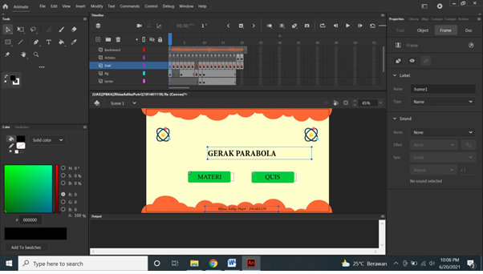
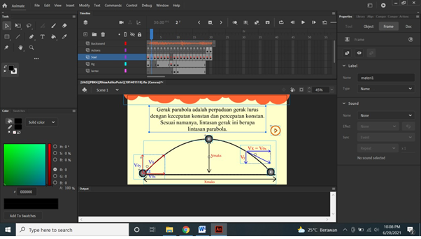
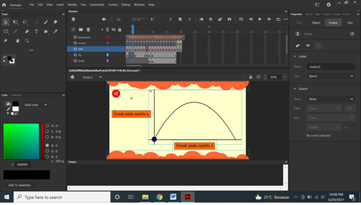
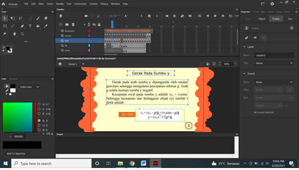
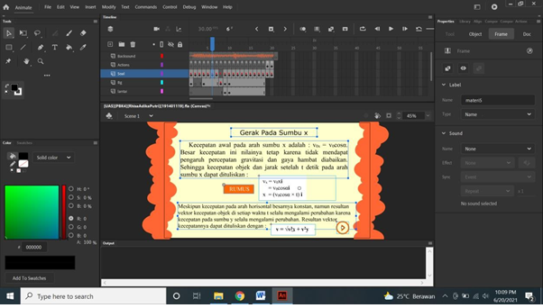
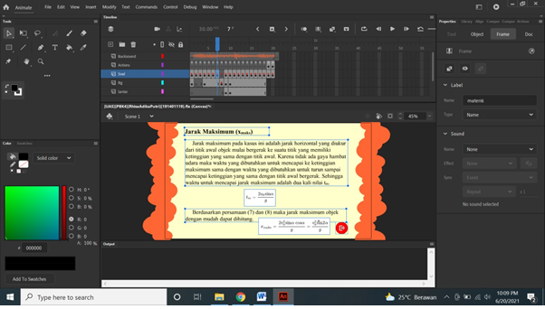
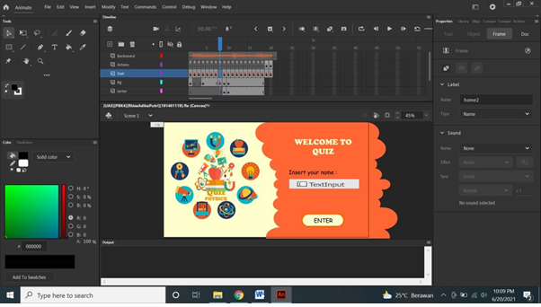
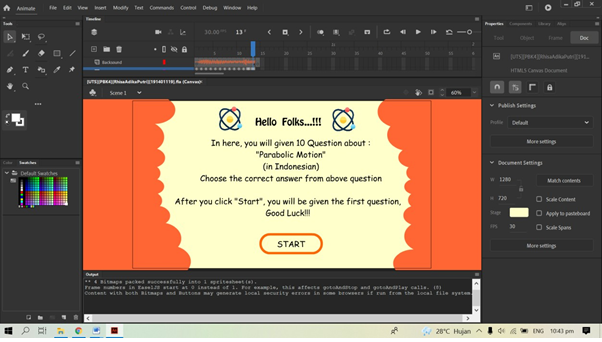
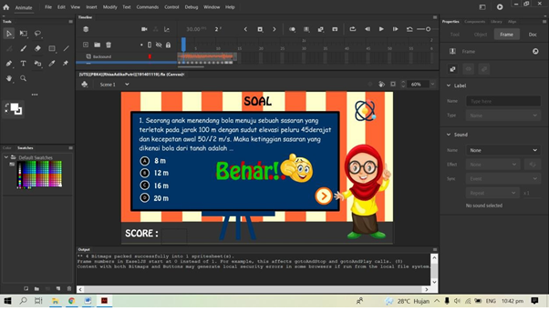
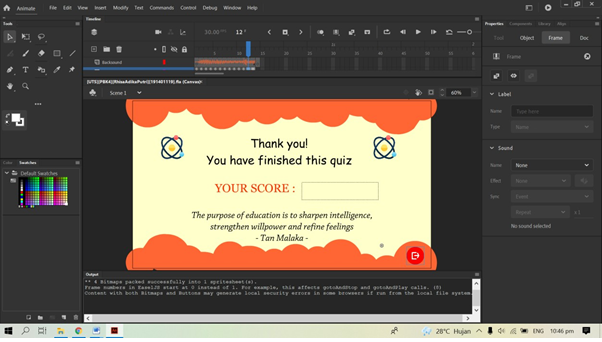

# Parabolic Motion - Interface HTML5

Create an HTML5 interface with the theme "Parabolic Motion" which contains material and interactive Quiz, with the following conditions:
- Have a minimum of 10 questions according to the subject matter that you have previously chosen.
- Has an initial / opening screen (splashscreen) before the question is displayed.
- Questions can display "True/False" output when the user answers the question. (answers are clicked green if they are correct, or red if they are wrong and use voice).
- Using background.
- Import assets such as images and sounds.

## Some app screenshots

### TampilanAwal

### Materi

### Quiz

